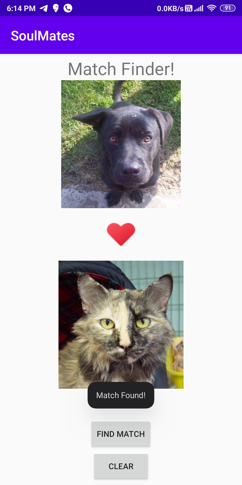

# 30DaysOfKotlin
Project Submission for qualifying 30DaysOfKotlin

## Project Name - *SoulMates*

## Description
This a entry level project to demonstrate use of *LinearLayout* along with some concept used in kotlin like - 
* Nullable reference
* Visiblity modifier
* Inheritance
* Late initialization
* Extracting string resoures ...

## Screenshot

|  |  |  |
|:---:|:---:|:---:|
| Icon Image | Default View | Match Found! |
